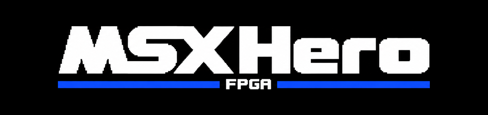
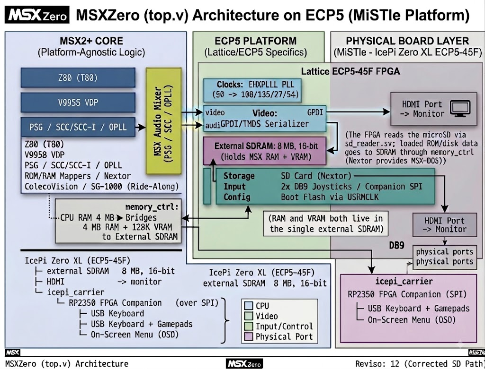

# MSXHero — an MSX2+ computer on the IcePi Zero XL (Lattice ECP5 45F)

Status: work in progress. The core builds and boots in simulation; it has not run on hardware yet.
The whole design synthesizes, fits the 45F (75% logic), routes, and packs a bitstream. The SDRAM is
validated in simulation on both ports (the full 8 MB), and the whole machine boots in a full-design
simulation with the Z80 executing C-BIOS. The design is therefore validated logically; what remains
is the physical bring-up on the board (the `clk_54m` timing is a multicycle path that should be fine).
See the progress tables below.

MSXHero is built on the MiSTle project's hardware: the IcePi Zero XL and the icepi_carrier, with an
RP2350 as the FPGA Companion (USB input, SD, on-screen menu). The IcePi Zero XL is the larger-FPGA
variant of the IcePi Zero — an ECP5-45F instead of the standard 25F — made within the MiSTle project.
MSXHero is not officially a MiSTle core; it just runs on the same board and companion that MiSTle
cores like NanoMig use. The design itself is a fork of
[Papipapito/MSXnano](https://github.com/Papipapito/MSXnano), ported from the Tang Nano 20K (Gowin)
to the IcePi Zero XL (ECP5, 45F).

## Roadmap

The project runs on two tracks:

- Track 1 — the devboard core, for everyone. An MSX2+ that anyone can build and flash on an
  off-the-shelf IcePi Zero XL + icepi_carrier. Its first milestone is booting the machine (Beta 1,
  below); devboard-fit features come after.
- Track 2 — a dedicated MSX board. A purpose-built board for the things the devboard physically
  can't provide — a real cartridge slot, RGB/SCART output, a WiFi radio.

### Track 1, Beta 1 — boot the MSX2+ on the devboard

These are the items needed to get a real MSX2+ running on the IcePi Zero XL. This is the immediate goal.

| Stage | Status | Done |
|---|---|---|
| Research / target lock-in (IcePi Zero XL + carrier) | complete | 100% |
| Open-source toolchain (Yosys + nextpnr-ecp5 + ghdl) | installed & verified | 100% |
| Clocks / PLL (`EHXPLLL`, 50→107.69/134.6/26.92/53.85) | synthesizes; phase to tune on HW | 90% |
| Video output (ECP5 GPDI/TMDS) | RTL done; a standalone HDMI test-pattern harness (`fpga/bringup/`) builds + routes + times cleanly (clk_135 ~300 MHz), isolating the PLL + encoder + `serializer_ecp5` GPDI path. Untested on a real monitor | 88% |
| Constraints (`icepi.lpf`) | mapped; flash clock via `USRMCLK` — done (routes `1/1`) | 100% |
| Gowin-primitive cleanup (BUFG, file list) | done | 85% |
| Full synthesis (compile the whole design) | done — the whole core maps to ECP5 primitives with the open-source flow | 100% |
| Fit on the 45F (nextpnr place & route) | fits + routes + packs to a .bit: 75% logic (33166/43848 LUT4), 29% FF, 16% BRAM (18/108), 12% DSP (9/72), 1 PLL, 1 `USRMCLK` | 90% |
| Bitstream (ecppack) | done — full flow RTL→synth→P&R→`msx_ecp5.bit` (~700 KB) | 100% |
| `clk_54m` (Z80) timing | routes at ~24–36 MHz (varies with placement). But the worst path is the clock-enabled T80 CPU (runs at 3.58/5.37 MHz — the FFs advance ~1 in 10–15 base cycles), so it's genuinely multicycle and the 53.85 MHz check is far stricter than the CPU actually needs → very likely fine on hardware. nextpnr can't express multicycle. abc9 is now enabled (2026-08-19 — the XAIGER crash was `inout` ports, fixed with explicit `TRELLIS_IO` buffers; see `fpga/docs/abc9_issue.md`) but did not move Fmax: the ~24–36 MHz spread is placement noise, not mapping quality. HW-confirm pending | 70% |
| SDRAM controller (16-bit) | narrow memory.v to 16-bit (not wrap NanoMig). memtest PASSES for BOTH ports in sim (`fpga/sim/`, iverilog 4-state): CPU RAM (byte lanes, rows, full 8 MB across all 4 banks, no aliasing) and VRAM (8-bit write / 16-bit read, bank 3, no cross-interference). Whole data path validated; the 13/9 geometry rewrite was found unnecessary. Remaining: on-HW SDRAM phase tuning (board-only). `fpga/SDRAM_PORT.md`, `fpga/sim/README.md` | ~75% |
| Boot validation (full-design sim) | the whole MSX boots in iverilog and the Z80 executes C-BIOS from SDRAM (`fpga/sim/`) — validates the CPU + memory + BIOS path logically (80 K+ steady BIOS fetches). A drawn frame is not reachable in this sim: C-BIOS spins in early init (slot-detect / vblank-IRQ) before video, so VRAM stays empty — the real screen comes from hardware (bring-up) | 80% |
| Bring-up harnesses | done — standalone HDMI test-pattern (stage 3) and SDRAM memtest (stage 4) bitstreams in `fpga/bringup/`, each reusing the real modules so video + memory can be proven independently on the board. The SDRAM one is sim-validated ("SDRAM HARNESS: PASS") and reports on the LEDs. See `fpga/BRINGUP.md` | 100% |
| On-hardware bring-up (HDMI / SDRAM / companion / DB9) | not started (board pending) — procedure/risks/tuning prepped in `fpga/BRINGUP.md`, and the stage-3/4 harnesses above are ready to flash. Now "confirm + tune," not "debug from scratch" (design validated in sim) | 5% |
| Beta 1 overall | the entire pre-hardware side is done: builds + fits + bitstreams; SDRAM validated; boots + runs C-BIOS in sim; flash-boot (`USRMCLK`) closed; and stage-3/4 bring-up harnesses built + sim-validated. All that remains is the physical on-hardware bring-up — which is deliberately the last ~30% and can't be retired from a chair (real SDRAM phase, HDMI sync on a monitor, companion USB, `clk_54m` confirm, actual C-BIOS boot) | ~70% |

### Track 1 — devboard additions (after Beta 1)

Once the machine boots, these are the features that fit the IcePi Zero XL as it is.
The 45F fit leaves ~25% LUT headroom plus free BRAM/DSP, so the sample-based OPL4 is comfortable
while the LUT-heavy V9968 is a coin-flip. (That 75% is a toolchain number, not bloat — see the
LUT-reduction levers below; abc9 is now done (-5.5%), so de-duping the two HDMI encoders is the
remaining lever.)

| Feature | Status | Done |
|---|---|---|
| OPL4 / MoonSound (`YMF278B`) | core vendored (`fpga/opl4wave/`), not wired; needs ECP5 wave-ROM memory + an OPL3 FM core | 5% |
| OPL4 "super hi-res" samples (interpolation option) | idea only — cheap on the 45F, keep as an A/B toggle vs authentic | 0% |
| V9968 (accurate V9958, HRA!) | evaluate — LUT-heavy, tight at 75% base (but see LUT-reduction below); measure standalone first | 0% |
| turboR PCM (8-bit DAC) | the MSX turboR's 8-bit PCM sample-playback device — a small DAC channel into the existing audio mixer (HRA recently added it to OCM-PLD). Cheap logic, adds sample audio, plays over HDMI. Genuine low-hanging fruit | 0% |

Already on the devboard (not future work): SD card (Nextor / MSX-DOS 2, 4-bit SD pinned in
`icepi.lpf` + microSD on the carrier) and USB keyboard/gamepads (RP2350 FPGA-Companion over SPI —
needs companion firmware, not new logic). These are Beta-1 bring-up items.

### Track 2 — dedicated MSX board

Not possible on the IcePi Zero XL — these need a purpose-built board with the right connectors and
analog stages. In every case the FPGA logic is present or cheap; the gap is physical.

Track 2 is a long-term goal, not a near-term plan. This is a hobby project worked on in spare time
around a busy schedule, so the dedicated board and the features on it may take a while.

| Feature | Status | Done |
|---|---|---|
| Real cartridge slot | a physical MSX cartridge edge connector — needs board pins + 5 V level-shifting. The core already has the interface (`ex_bus_*`/pinfilter in top.v, tied off now); the dedicated board wires it to real bidirectional IO through level shifters | 0% |
| RGB (SCART) video out | the authentic 15 kHz MSX picture — analog RGB + composite sync (240p/288p) to a SCART TV / PVM / OSSC, sharper than the HDMI upscale. The VDP already produces the digital RGB at native rate; needs a raw pre-scandouble 15 kHz tap + a CSync generator (modest logic) plus an analog output stage (video DAC + SCART/DIN connector) | 0% |
| WiFi | the MSX core already has the WiFi modem plumbing (the `wifi_lite` entity + WiFi ROM region + a UART modem, a vendored MSXnano feature). Undecided is the radio hardware: the RP2350 has no built-in radio, so the options are an external module on a UART (an ESP, for example) or a WiFi-capable companion — not decided yet | 0% |
| Analog audio out (line-out / MIDI) | the core already mixes PSG / SCC / OPLL to stereo 16-bit and plays it over HDMI (Track 1, works today). Analog line-out needs a PWM / sigma-delta DAC + RC filter + a jack (cheap), or an I2S codec. MIDI out needs a UART-style pin + a DIN connector | 0% |
| Battery-backed RTC | the core already emulates the MSX RTC (RP-5C01), so software has a clock — but the FPGA has no persistent time source, so it resets each power-on. A battery-backed RTC chip (e.g. DS3231 + coin cell, I2C) seeds real wall-clock time at boot: authentic (like a real MSX2+), offline, cheap, small logic (I2C read → seed the emulated RTC). WiFi NTP is an alternative once WiFi exists | 0% |

LUT-reduction backlog (the 75% is a toolchain story, not bloat). From the real build data
(33166 LUT4, 18 BRAM, 0 distributed LUT-RAM, 9 DSP) the fit is a synthesis-mapping result — the
same RTL fits a Tang Nano 20K under Gowin's proprietary tools. Ranked levers, without removing any
MSX feature: (1) DONE 2026-08-19 — abc9 enabled after fixing the `inout` ports; measured
34362 -> 32481 LUTs (-5.5%, below the ~10–20% once estimated); (2) de-dup the dual HDMI encoder — `v9958_top.v` instantiates two full
`hdmi` encoders (NTSC VIC=2 + PAL VIC=17) and muxes one out (~5–9%). Ruled out by the data: RAM/flatten
duplication (BRAM is sane, zero distributed LUT-RAM). Target 1+2 ≈ 75% → ~60%. Details in `PORT_PLAN.md`.

> "Written" is the easy part; the build-and-bring-up phase is where most of the remaining effort is.

Toolchain note: the open-source flow needed real integration work for this mixed
VHDL/Verilog/SystemVerilog design: the SystemVerilog HDMI encoder is pre-converted with
sv2v (yosys can't parse unpacked-array ports / `real` params); each VHDL boundary entity
is elaborated with ghdl and flattened to RTLIL (the `-read` path crashes on multiple VHDL
modules, and shared sub-entities like `ram` must not be re-defined); and several source nits
that Gowin tolerated were fixed (package shared-variables, a missing instance name, port-name
case, `real`→integer math). See `fpga/build_ecp5.sh` and `BUILD_ECP5.md`.

## Features

A complete MSX2+ home computer in FPGA logic — the actual hardware recreated, not an emulator on a
CPU — plus two bonus consoles that share the silicon. The MSX2+ core is inherited from MSXnano; this
list is cross-checked against MSXnano's own feature list and confirmed present in this port:

- CPU: Z80 (T80) with authentic MSX timing (per-M1 wait states, ~100% of real-MSX speed) plus a Turbo mode (~4.13 MHz).
- Video: V9958 VDP — all MSX / MSX2 / MSX2+ screen modes, sprites, 19268-colour YJK modes, hardware scroll — output over HDMI (ECP5 GPDI), 128 KB VRAM.
- Sound: PSG (AY-3-8910 / YM2149), SCC / SCC-I, OPLL (YM2413, MSX-Music), mixed to stereo and carried in the HDMI audio.
- Memory / cartridges: MSX2+ BIOS + sub-ROM, a 4 MB memory mapper and a 2 MB MegaRAM / MegaROM (ASCII8/16, Konami, Konami-SCC), with mapper auto-detection by ROM content (openMSX-style) and cartridge SRAM saves.
- Storage: microSD with the Nextor kernel (MSX-DOS 2), plus a boot-menu file browser to launch `.ROM` / `.DSK` images.
- Clock/config: MSX RTC and configuration saved to flash.
- Input: USB keyboard, gamepads and mouse via the RP2350 FPGA-Companion (over SPI); two DB9 joystick ports read natively by the PSG.
- Controls (OCM Switched-I/O): per-chip and master audio volume, CPU turbo/speed, 50/60 Hz region toggle, machine type.
- WiFi: MSX UNAPI via an external ESP modem, with the WiFi BIOS ROM built into the ROM pack (needs an ESP radio — see Track 2).
- Consoles: ColecoVision and Sega SG-1000 emulation (SN76489 sound), launched from the boot menu.

## Architecture

The left column is the MSX machine itself (portable logic); the right column is the ECP5 platform
layer the port swaps out per board (this is the split the MiSTle board-abstraction refactor formalises).
The point worth stressing, which a naive block diagram gets wrong: the MSX's RAM and VRAM are not
separate memories — both live in the single external SDRAM, serviced by `memory_ctrl`.

## The ECP5 port (this fork)

The goal is to keep the MSX2+ core and swap the Gowin platform layer for ECP5. Every ECP5 change is
behind `` `ifdef ECP5`` and lives in `fpga/src/lattice/`, so the original Gowin build stays intact.
Target hardware is the MiSTle project's board: an IcePi Zero XL (ECP5-45F) on the icepi_carrier with the
RP2350 FPGA Companion — the same board and companion NanoMig runs on. Because that carrier is shared,
aligning this port to the same board-abstraction layout NanoMig uses (instead of the current inline
`` `ifdef ECP5``) is a planned post-Beta-1 refactor; see `PORT_PLAN.md`.

Done — the core builds, fits, and boots in sim:
- The whole core synthesizes, fits, and packs to a bitstream on the open-source flow
 (Yosys + ghdl + nextpnr-ecp5 → `ecppack`). On the LFE5U-45F: 75% logic (33166/43848
 LUT4), 29% flip-flops, 16% block RAM, 12% DSP, 1 PLL, 1 `USRMCLK` — the base MSX2+ fits with room
 to spare (and that 75% is a toolchain number — see the LUT-reduction backlog above).
- Boots in a full-design simulation — the whole mixed-language MSX runs in iverilog and the Z80
 executes C-BIOS from SDRAM (`fpga/sim/`); SDRAM memtest passes for both ports. Design validated logically.
- Flash boot + bring-up harnesses — the flash clock routes through `USRMCLK` (boot-from-flash),
 and `fpga/bringup/` has standalone HDMI-test-pattern + SDRAM-memtest bitstreams for staged board bring-up.
- Clocks — `clocks_ecp5.v`: one `EHXPLLL` from the 50 MHz osc → 107.69 (sys) / 134.6 (TMDS) /
 26.92 (pixel) / 53.85 MHz. (Exact 108 MHz isn't reachable from 50 MHz without an out-of-spec
 2 MHz phase detector; the system runs 0.28% low — within HDMI tolerance, imperceptible for MSX.)
- Video output — `serializer_ecp5.sv`: ECP5 `ODDRX1F` GPDI, replacing the Gowin `OSER10` + `ELVDS_OBUF`.
- Constraints — `icepi.lpf`: clock, GPDI, 16-bit SDRAM, SD, flash, LEDs, buttons, companion SPI, DB9 joysticks.
- DB9 joysticks read natively by the PSG (added in this port), plus the RP2350 companion over SPI.
- Mixed-language build — the tricky part. The SystemVerilog HDMI encoder is pre-converted with
 sv2v (yosys can't parse its unpacked-array ports / `real` params); each VHDL boundary entity is
 elaborated with ghdl and flattened to RTLIL (ghdl's `-read` crashes on multiple VHDL modules);
 LUTs are mapped with abc9 (re-enabled 2026-08-19 after fixing the inout ports — the XAIGER
 design issue; see `fpga/docs/abc9_issue.md`). A dozen source nits Gowin silently tolerated are
 fixed (package shared-variables, `real`→integer math, an async-load PSG envelope, a PSG tri-state
 loop, a tri-stated clock net → proper gated clock, port-name case, a missing instance name).
 See `fpga/build_ecp5.sh` + `BUILD_ECP5.md`.

Remaining — on-hardware bring-up (no FPGA glue left):
- The board is the last mile. Nothing here is silicon-tested yet. Bring-up order (with the ready
 harnesses): config → clocks/LEDs → HDMI test pattern → SDRAM memtest → companion/USB keyboard
 → SD/Nextor → C-BIOS boot. See `fpga/BRINGUP.md`.
- `clk_54m` (Z80) timing — routes but runs ~24–36 vs the 53.85 MHz target. The worst path is the
 clock-enabled (multicycle) T80 CPU, so it's very likely fine on hardware (the SDRAM-only harness
 hits ~180 MHz on the same clock — the "failure" is the CPU path). Clean fixes are blocked by
 open-source tool limits (nextpnr cannot express multicycle; abc9 is enabled but did not move Fmax). HW-confirm pending.
- SDRAM phase tuning — the 16-bit `memory.v` memtest passes in sim (both ports) and in the standalone
 harness; the only board-specific step is tuning the read-capture clock phase. See `fpga/SDRAM_PORT.md`.
- LUT reduction (optional, no HW needed) — abc9 DONE (-5.5%); de-dup the dual HDMI encoder remains; see above.
- OPL4 / MoonSound and other extras — see the "future features" table above and `PORT_PLAN.md`.

## Building

Open-source flow: `cd fpga && ./build_ecp5.sh` (needs the OSS CAD Suite). Details: `fpga/BUILD_ECP5.md`.
Bring-up harnesses: `bash bringup/build_hdmi_test.sh` and `bash bringup/build_sdram_test.sh` (standalone
video / memory test bitstreams). Roadmap: `PORT_PLAN.md`. SDRAM plan: `fpga/SDRAM_PORT.md`. Bring-up: `fpga/BRINGUP.md`.

## References & credits

### Hardware & platform — the MiSTle project
MSXHero runs entirely on hardware and companion software from the
[MiSTle project](https://github.com/MiSTle-Dev) (thanks to Till Harbaum and the MiSTle-Dev team):
- **IcePi Zero XL** devboard + **icepi_carrier** — [MiSTle-Dev/Boards](https://github.com/MiSTle-Dev/Boards/tree/main/icepi_carrier)
- **FPGA-Companion** — the RP2350/PICO2 firmware that provides USB keyboard/gamepads, SD and the
  on-screen menu over SPI — [MiSTle-Dev/FPGA-Companion](https://github.com/MiSTle-Dev/FPGA-Companion)
- **NanoMig** — a MiSTle core on the same carrier; its 16-bit SDRAM controller is the reference for
  ours, and its top-level is our blueprint for the board-abstraction refactor — [MiSTle-Dev/NanoMig](https://github.com/MiSTle-Dev/NanoMig)

MSXHero is not an official MiSTle core — it targets the same board and companion.

### Core & sound
Based on [Papipapito/MSXnano](https://github.com/Papipapito/MSXnano) ← jabadiagm/MSXgoauldSD_tn20k.
GPL-3.0 (`LICENSE`). OPL4 core vendored from [Papipapito/MSXimus](https://github.com/Papipapito/MSXimus)
(GPL-3.0). `jtopl` FM cores by jotego (GPL-3.0). ECP5 SDRAM/DVI reference:
[`cheyao/icepi-zero`](https://github.com/cheyao/icepi-zero). Upstream README kept as `README.upstream.md`.

Parts of this port were done with assistance from Claude (an AI coding assistant).
